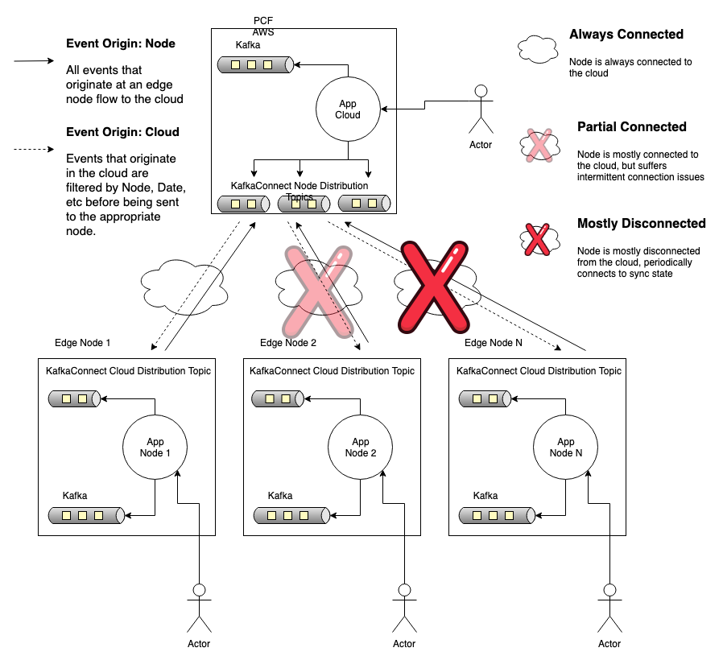

# Event Stream Demo

The purpose of this demo is to illustrate how events that originate in the cloud
or at any number of nodes could be merged together. It was imperative to focus 
on 3 specific scenarios:

* Cloud and Nodes are always connected
* Cloud is always on, nodes have intermittent connectivity
* Cloud is always on, nodes are disconnected



The above diagram illustrates the three connected scenarios.

## Work Order Domain

This demo is single, fictional, Work Orders application that consists of 
multiple profiles:

* cloud - the application running in an always-on, cloud-like environment
* local - a local version running off a workstation
* node-17 - a fictional node somewhere out in the field
* node-34 - a fictional node somewhere out in the field

The application is constructed using DDD best practices, where the emphasis is 
placed on the domain, specifically a Work Order. Actions performed against a 
Work Order trigger domain events. The events are persisted to maintain and 
retrieve state.

Domain Events a written out as JSON to an event stream. The event stream is 
responsible for communicating the state of the domain has changed. It is also 
how projections are derived from the event history.

## Prerequisits

* Java 8

```bash
$ brew cask install adoptopenjdk8
```

* Apache Kafka

Apache Kafka will store the events in topics respective to each profile of 
application configured. Kafka Connect is used to bridge the cloud and node
instances.

```bash
$ brew cask install adoptopenjdk8

# Review the state of the services
$ brew services list

# If the services are not started
$ brew services start zookeeper
$ brew services start kafka
```

## Build the application

The application is packaged with a version of the Maven Wrapper and can be built
with no other dependencies or IDE required. Maven will do the heavy lifting of
finding all the dependencies and building the archive.

```bash
$ ./mvw clean package
```

*NOTE:* make sure to start in the cloned repository directory


## Start the _cloud_ application

When the application starts up in the _cloud_ profile, it will automatically 
create the cloud events topic in Apache Kafka, as well as the the distribution
topics for each node.

```bash
$ export SPRING_PROFILES_ACTIVE="cloud" && java -jar target/event-stream-demo-0.0.1-SNAPSHOT.jar
```

*NOTE:* make sure to start in the cloned repository directory in a new terminal

## Start a _node_ application

When the application starts up in a _node_ profile, it will automatically 
create the node events topic in Apache Kafka, as well as the the distribution
topic that reaches the cloud.

_Start the Local Node_
```bash
$ export SPRING_PROFILES_ACTIVE="local,node" && java -jar target/event-stream-demo-0.0.1-SNAPSHOT.jar
```

*NOTE:* make sure to start in the cloned repository directory in a new terminal

_Start the Node-17 Node_
```bash
$ export SPRING_PROFILES_ACTIVE="node-17,node" && java -jar target/event-stream-demo-0.0.1-SNAPSHOT.jar
```

*NOTE:* make sure to start in the cloned repository directory in a new terminal

_Start the Node-34 Node_
```bash
$ export SPRING_PROFILES_ACTIVE="node-34,node" && java -jar target/event-stream-demo-0.0.1-SNAPSHOT.jar
```

*NOTE:* make sure to start in the cloned repository directory in a new terminal

## Data

The Data files that get produced by Kafka and Kafka connect can be found in:

```
src/main/kafka/data
```

These are used primarily for demonstration purposes. KafkaConnect supports multiple types 
of Sinks and Sources. The File sinks and sources are used here to demonstrate separate Kafka
instances running. These could easily be swapped out for Distributed KafakConnect configurations, rather 
than the Standalong configurations used here. These are configurations are located in:

```
src/main/kafka/cloud
src/main/kafka/nodes
```

## Scripts

Apache Kafka commands can be quite verbose. For convenience, there are number of
scripts to help perform common tasks. These can be found in the following 
directory:

```
/src/main/kafka/scripts
```

### Starting Kafka Connect

When all 4 application instances have been started, Kafka Connect can be started
and will bridge the distribution topic with their respective destinations.

```bash
$ ./src/main/kafka/scripts/start-kafka-connect.sh
```

### List all the Kafka topics

```bash
$ ./src/main/kafka/scripts/list-topics.sh
```

### Delete all the Kafka topics

```bash
$ ./src/main/kafka/scripts/delet-workorder-event-topics.sh
```

It is advisable to also delete all the data files.

```bash
$ rm -rf src/main/kafka/data/*
```

### Follow a topic

There are number of script setup to follow the individual topics. They are 
broken out by node. Choose the most appropriate one for your needs. Scripts are located in:

```
src/main/kafka/scripts
```

| Script | Description |
| :----  | :-----      |
| follow-cloud-workorder-events.sh | Follow the cloud workorder-events topic. This is the source of truth for all nodes. |
| follow-cloud-distribution-local.sh | Follow the local distribution topic. Events in this topic are transferred to the local node. |
| follow-cloud-distribution-node17.sh | Follow the node-17 distribution topic. Events in this topic are transferred to node-17. |
| follow-cloud-distribution-node34.sh | Follow the node-34 distribution topic. Events in this topic are transferred to node-34. |
| follow-local-workorder-events.sh | Follow the local workorder-events topic. Events originating from this node are published to the distribution node to be sent to the cloud. |
| follow-local-distribution-cloud.sh | Follow the local cloud distribution topic. Events in this topic are always sent to the cloud. |
| follow-node17-workorder-events.sh | Follow the node-17 workorder-events topic. Events originating from this node are published to the distribution node to be sent to the cloud. |
| follow-node17-distribution-cloud.sh | Follow the node-17 cloud distribution topic. Events in this topic are always sent to the cloud. |
| follow-node34-workorder-events.sh | Follow the node-34 workorder-events topic. Events originating from this node are published to the distribution node to be sent to the cloud. |
| follow-node34-distribution-cloud.sh | Follow the node-34 cloud distribution topic. Events in this topic are always sent to the cloud. |

### Follow a KTable

The workorders are grouped by Work Order Id into KTables to make lookup and replay easier. Using the same console 
consumer the KTables can also be followed. Since the contents are just JSON, they can be easily consumed by an 
application or a person. Scripts are located in:
                         
```
src/main/kafka/scripts
```

| Script | Description |
| :----  | :-----      |
| follow-cloud-workder-by-id-ktable.sh | Follow the cloud workorder-events by Work Order Id. |
| follow-local-workder-by-id-ktable.sh | Follow the local workorder-events by Work Order Id. |
| follow-node17-workder-by-id-ktable.sh | Follow the node-17 workorder-events by Work Order Id. |
| follow-node34-workder-by-id-ktable.sh | Follow the node-34 workorder-events by Work Order Id. |

